# tutorial01

## TITLE:
Transmission Line modeling using Advanced Design System (ADS)

## USING ADS FOR TRANSMISSION LINE MODELING
- This tutorial covers getting started with Advanced Design System (ADS) for the simulation of a transmission line.
- The schematic simulation of an ideal transmission line is covered in this handout. 
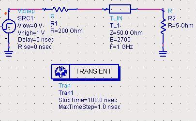

## HOW TO START A NEW PROJECT?
- When you launch the ADS, a main window appears, displaying a file browser to select previous projects. Select `New Workspace` from the toolbar to start a new project.
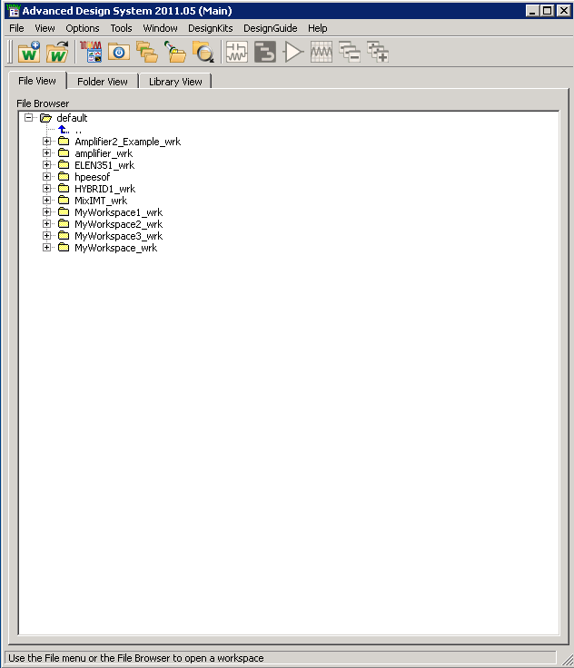

## SETTING UP A NEW WORKSPACE
- A New Workspace Wizard pops up to guide setup. Give your new workspace a name and click `Next` three times.
- Set the “`Length Unit`” to millimeter by selecting “`Standard ADS Layers, 0.0001 millimeter layout resolution`”
- Click `Finish`.
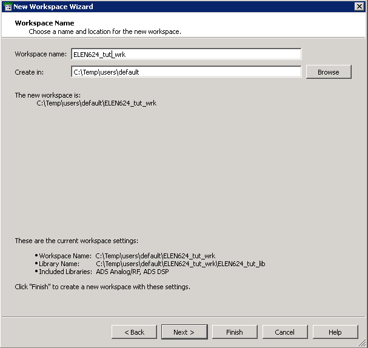
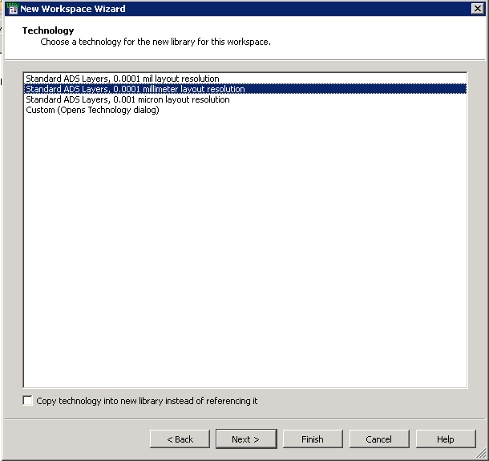

## OPEN A NEW SCHEMATIC WINDOW
- To create a new schematic, click the `New Schematic Window` button in the toolbar. Give the cell a new name and click `OK`.
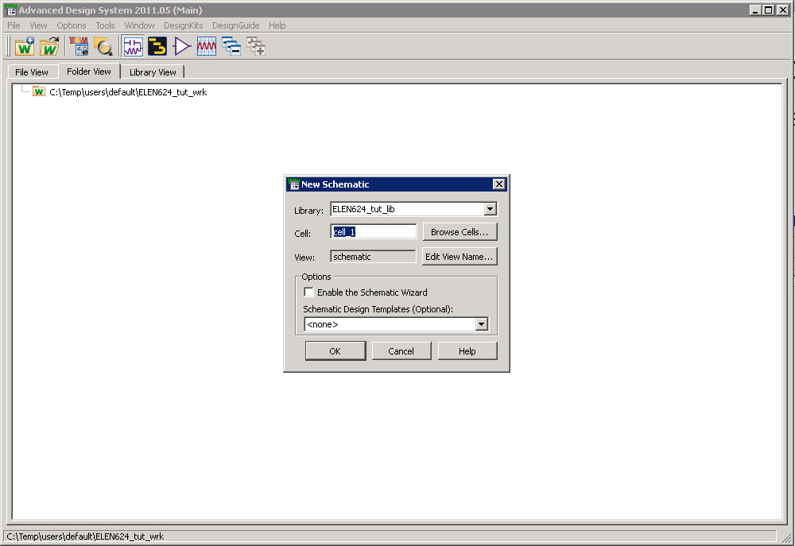

## SCHEMATIC ENDITOR WINDOW
- First, select `Cancel` from the Schematic Wizard dialog.
- From the selection box on the the window’s toolbar choose “`TLines-Ideal`”.
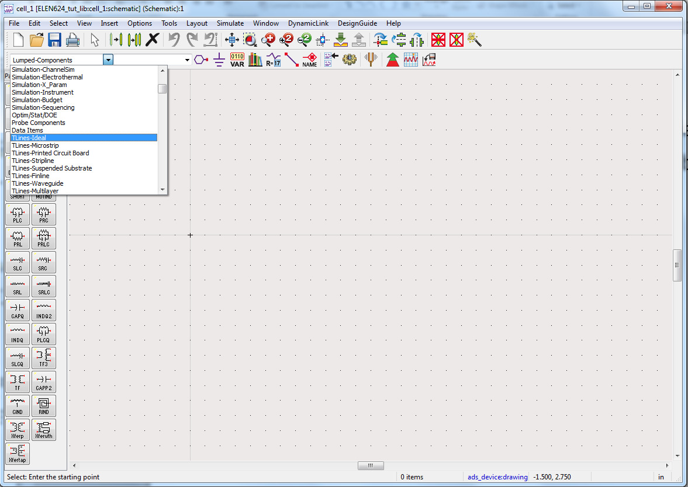

## ADDING A TRANSMISSION LINE
- Choose “`TLIN`” from the palette at the left of the schematic editor window for an ideal two terminal transmission line.
- By right clicking the mouse and choosing “`End Command`”, the cursor returns to its normal state.
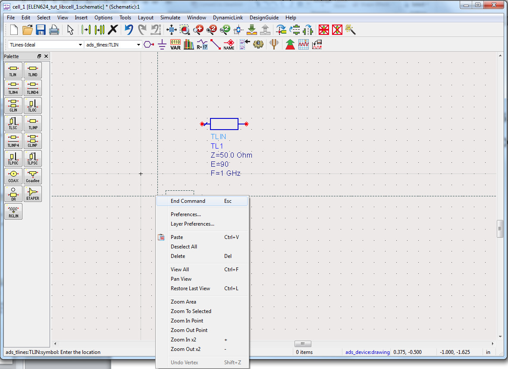

## SETTING THE TRANSMISSION LINE PARAMETERS
- Double click on the inserted transmission line. In the appearing dialog box you can set the values for “`characteristic impedance`”, “`electrical length`”, and “`reference frequency for electrical length`”. In this exercise we use the default values except for an electrical length of 270°.
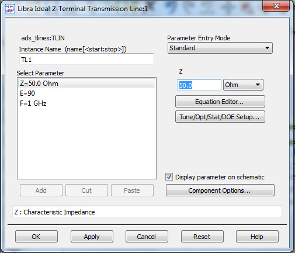

## ADDING LUMPED COMPONENTS
- From the selection box on the toolbar select “`Lumped-Components`”, and from the respective palette select “`Resistor`”; Add two resistor to the schematic and set their values to 200 and 5 Ohms
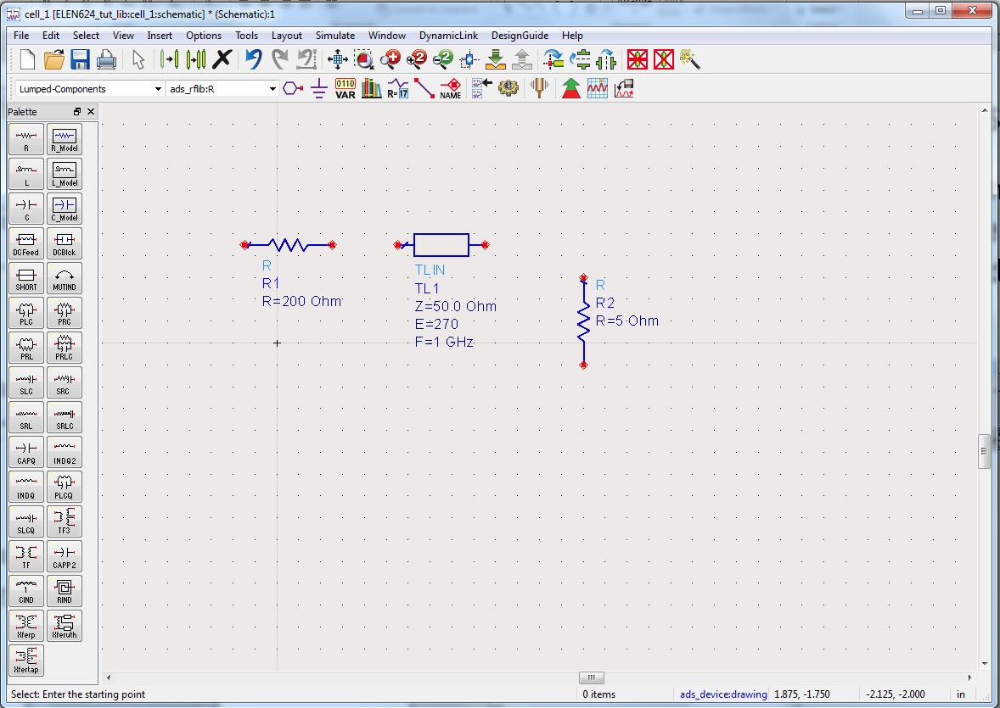

## ADDING SOURCES
- From the selection box on the toolbar select “`Sources-Freq Domain`”, and from the respective palette select “`AC Voltage Source`”.
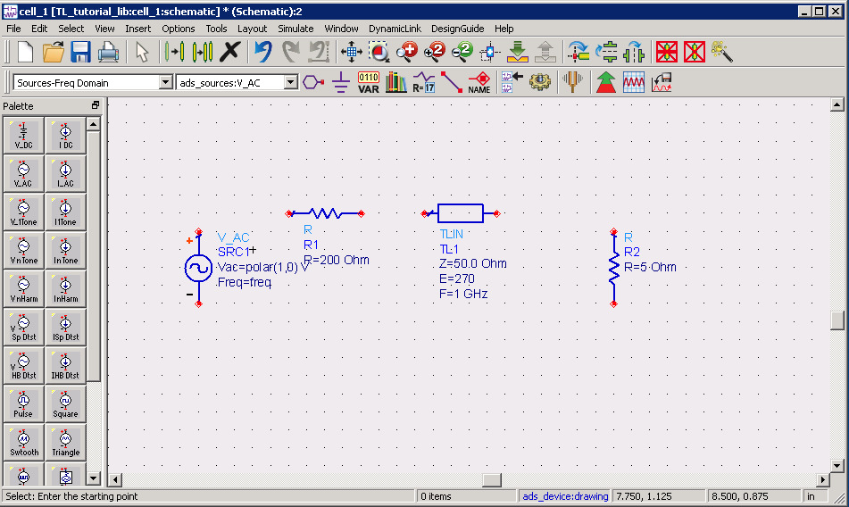

## ADDING SOURCES (CONT'D)
- By double clicking on the source you can set its parameters’ values. In this exercise use the default values except for the “`Rise Time`”, set the rise time to 0ns.
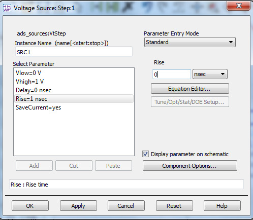

## SELECTING THE SIMULATION TYPE
- From the selection box on the toolbar select “`Simulation-AC`”, and from the respective palette insert a “`AC Small-Signal Simulation`”. Change the default values to `Start=0.5 GHz`, `Stop=5.0 GHz`, and `Step=0.1 GHz`.
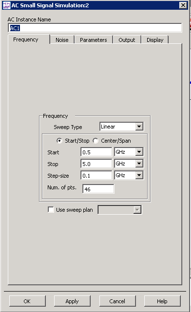

## ADDING GROUNDS AND WIRES.
- Add two grounds and wire everything together.
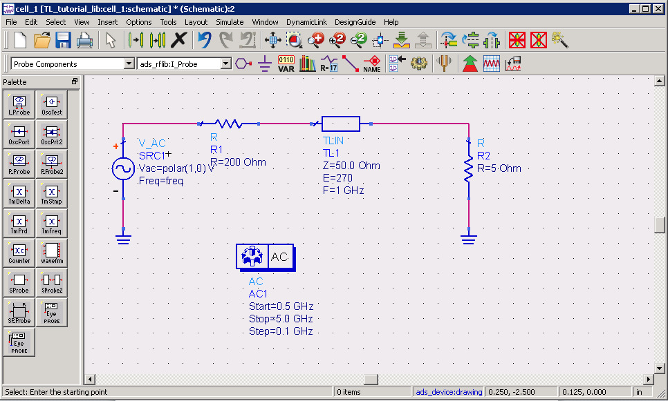

## INSERTING LABELS
- While using the “`AC Simulation`”, in order to be able to view the signal at a particular node, we must assign a label to this node. This is done by choosing the “`Insert Wire/Pin Label`” from the toolbar, typing a label in the appearing dialog box, and selecting the desired node before closing the dialog box. Label `Vin` and `Vout` accordingly.

## INSERTING CURRENT PROBES
A current probe must be inserted to view the current in the circuit. Using the Probe Components drop-down, select “`I_Probe`” and insert into 2 probes to the input and output of the transmission line. Remove wires accordingly.

## RUNNING THE SIMULATION
- While using the “`AC Simulation`”, in order to be able to view the signal at a particular node, we must assign a label to this node. This is done by choosing the “`Insert Wire/Pin Label`” from the toolbar, typing a label in the appearing dialog box, and selecting the desired node before closing the dialog box. Label `Vin` and `Vout` accordingly.
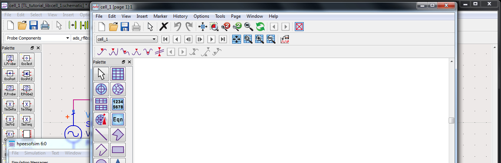

## VIEWING THE RESULT
Select the “`Rectangular Plot`” from the palette at the right of this new window, in the appearing window select “`Vin`”, click “`Add`”, and select “`Magnitude`”. Add additional plots for `mag(Vout)`, `mag(I_Probe1.i)`, and `mag(I_Probe2.i)`.
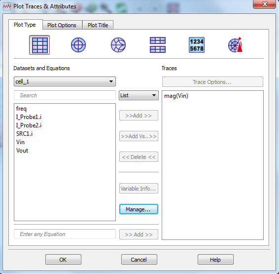

## VIEWING THE RESULT (CONT'D)
- After clicking `OK`, the output is drawn versus time. If you need to view the output versus another signal in the circuit, choose “`Add Vs..`” in the previous step and select the other signal in the popup menu that follows.
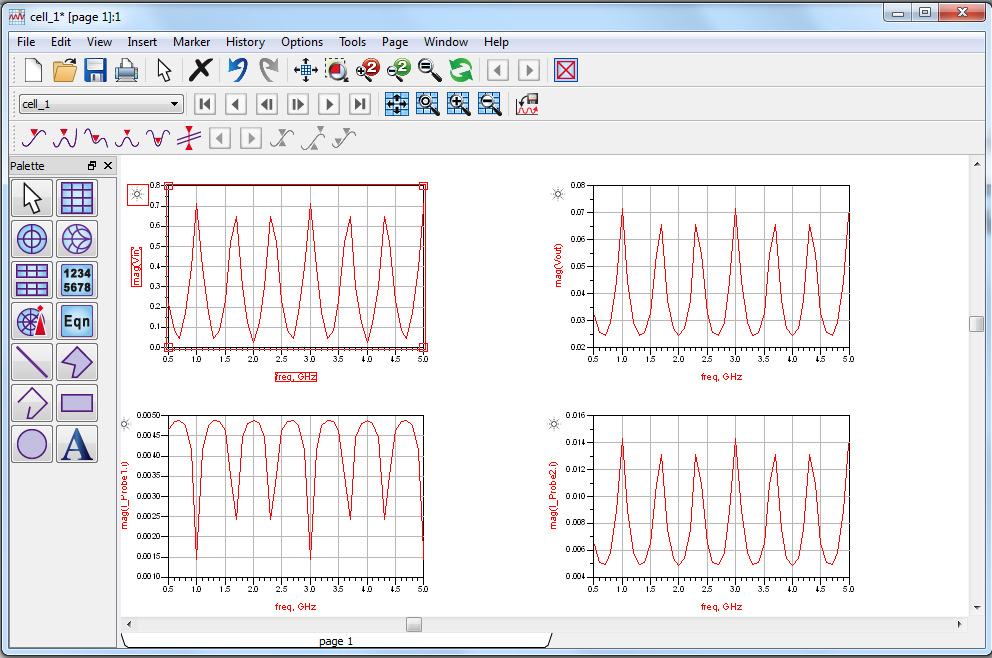

## INSERTING AN EQUATION:
- In the data display window, select the `Eqn` tile from the palette to insert an equation for output. In the `Enter Equation` dialog, insert the equation “`Zin=Vin/I_Probe1.i`”, click `OK`, and place the equation in the display window. Repeat for “`Zout=Vout/I_Probe2.i`”.
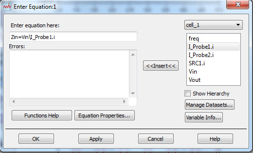

## VIEWING THE EQUATION OUTPUT
After clicking `OK`, insert a List into the display window. From the Datasets and Equations drop-down, select “`Equations`”. Choose “`Zin`” and click “`Add`”. Click `OK` to place the table in the display window. Repeat for `Zout`.
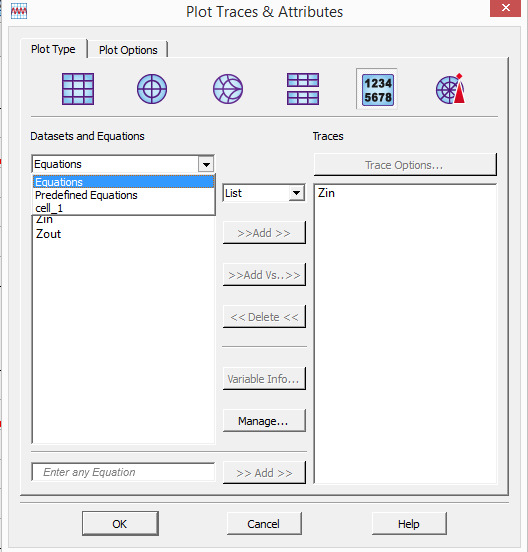

## VIEWING THE EQUATION OUTPUT (CONT'D)
- The final data display window should look like this:
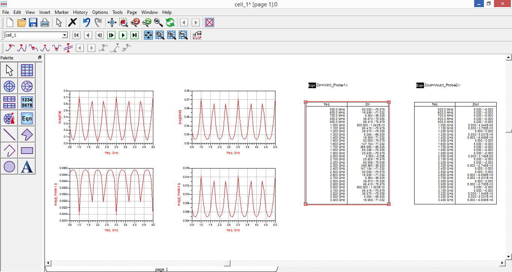
